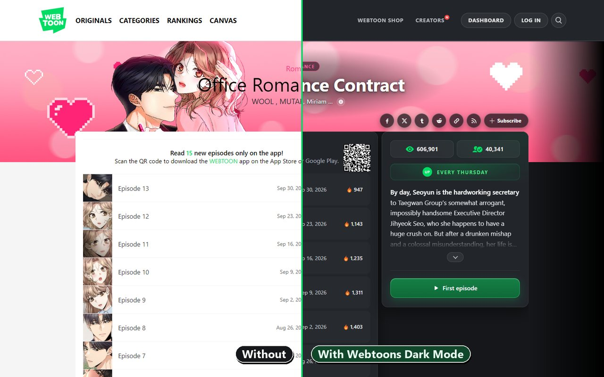
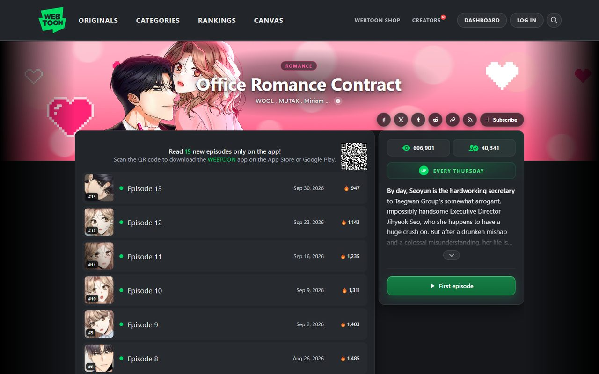
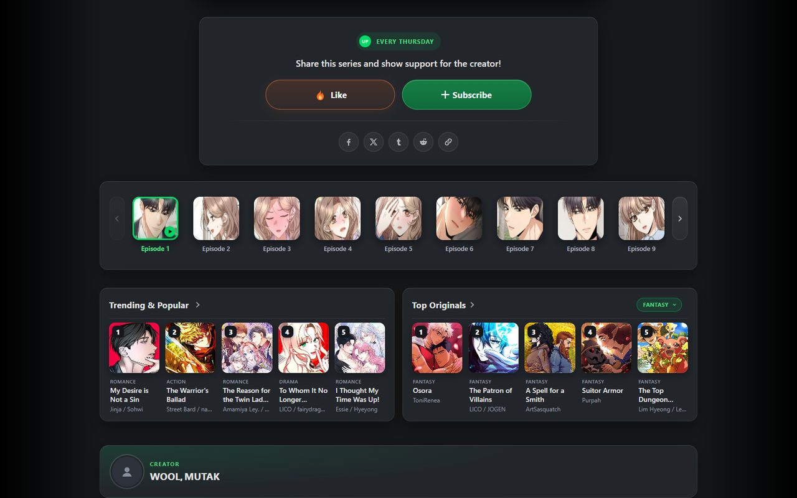
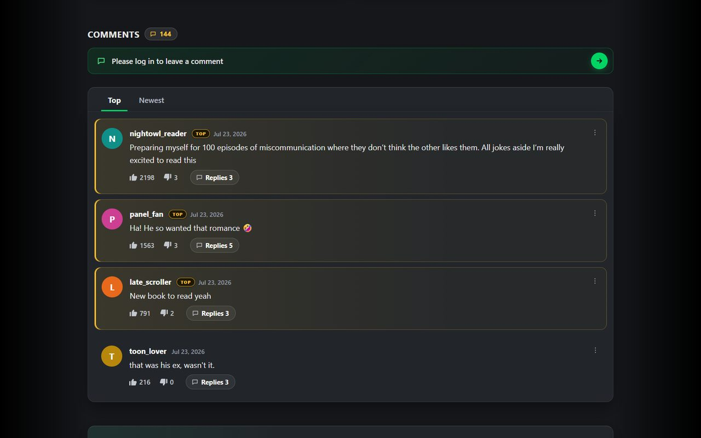

# Webtoons Dark Mode

A dark theme for [WEBTOON](https://www.webtoons.com) that keeps the comic's colours exactly as the artist drew them.

Most dark-mode extensions invert the whole page, which also inverts the artwork: skin tones go blue, pinks turn green. This userscript does the opposite. It restyles the site around the comic (header, menus, episode lists, comments, sidebars, popups) and never filters or recolours the comic panels. The only thing it does to the comic itself is frame it: the strip of panels is shown as one card with rounded corners, so the outer corners of the first and last panel are rounded off.

[](LICENSE)
[](https://github.com/hervad/webtoons-dark-mode/releases/latest)
[](https://greasyfork.org/scripts/577859)
[](https://chromewebstore.google.com/detail/toonlight-dark-mode-for-w/jefblpkbipgmpefdnninpnofkjckpafn)
[](https://microsoftedge.microsoft.com/addons/detail/toonlight-dark-mode-for-/iheadalpoiialennkmndleakobiilcfm)



<p align="center">
  
  
  
</p>

## Install

There are two ways to get the theme. Both run the same code; use one or the other (if both are installed, only one runs on a page).

### Browser extension: Toonlight (easiest)

One click, no userscript manager, and a toolbar button for the settings.

- **Chrome, Brave, Opera, Vivaldi:** [Toonlight on the Chrome Web Store](https://chromewebstore.google.com/detail/toonlight-dark-mode-for-w/jefblpkbipgmpefdnninpnofkjckpafn)
- **Edge:** [Toonlight on Edge Add-ons](https://microsoftedge.microsoft.com/addons/detail/toonlight-dark-mode-for-/iheadalpoiialennkmndleakobiilcfm)
- **Firefox (also Firefox for Android):** in review on Firefox Add-ons; until it's listed, use the userscript below.

The extension starts in dark mode and updates through the store.

### Userscript

For people who already use a userscript manager, and for Safari. Updates reach you as soon as they're published.

1. **Install a userscript manager** in your browser:
   - [Tampermonkey](https://www.tampermonkey.net/): Chrome, Edge, Firefox, Opera, Safari
   - [Violentmonkey](https://violentmonkey.github.io/): Chrome, Edge, Firefox
   - [ScriptCat](https://scriptcat.org/): Chrome, Edge, Firefox
   - Greasemonkey (Firefox) and [Userscripts](https://github.com/quoid/userscripts) (Safari) also work, with the limits listed under [Compatibility](#compatibility).
2. **Install the script** from one of these two places (pick one, not both):
   - **[Greasy Fork](https://greasyfork.org/scripts/577859)**: click **Install this script**.
   - **[GitHub](https://raw.githubusercontent.com/hervad/webtoons-dark-mode/main/webtoons-dark-mode.user.js)**: your userscript manager opens an install page; confirm it.
3. **Open or reload [webtoons.com](https://www.webtoons.com).**

Updates install automatically. A copy from Greasy Fork updates from Greasy Fork, and a copy from GitHub updates from this repository. Both get the same versions; Greasy Fork usually has a new version within a day.

> **Chrome, Edge and other Chromium browsers:** the browser needs an extra permission before any userscript can run. Open `chrome://extensions`, click **Details** on your userscript manager (Tampermonkey, Violentmonkey, ScriptCat), and turn on **Allow User Scripts**. On Chrome versions before 138, turn on **Developer mode** (top-right of `chrome://extensions`) instead.

## Using it

On first run the userscript follows your system setting: dark if your device is in dark mode, light otherwise (the Toonlight extension always starts dark). Once you switch it yourself, your choice is remembered. In the extension, the toolbar button lists the same settings as the userscript manager's menu.

| Action | Shortcut | Backup shortcut |
| --- | --- | --- |
| Turn dark mode on / off | `Alt + Shift + T` | `Ctrl + Alt + D` |
| Dim comic panels for night reading | `Alt + Shift + N` | `Ctrl + Alt + Shift + D` |
| Edge shading on / off | `Alt + Shift + V` | `Ctrl + Alt + Shift + V` |

On a Mac, `Alt` is the `Option` key. The backup shortcuts exist because `Alt + Shift` switches keyboard layouts on Windows computers with more than one input language. On keyboard layouts where `Ctrl + Alt + D` types a letter (such as Đ or ð), the script leaves that key alone so you can still type it; use `Alt + Shift + T` there.

The toggles are also in your userscript manager's menu (click its icon while on webtoons.com). Each entry says what clicking it will do, for example **Turn off dark mode** while the theme is on. Managers that can't relabel menu entries show **Toggle …** instead. Greasemonkey and the Safari Userscripts app have no menu for this script; the shortcuts work everywhere.

**Reader dim** lowers the brightness of the comic panels only, which is easier on the eyes in a dark room. It's off by default, and it works whether dark mode is on or off.

**Edge shading** darkens the empty margins to the left and right of the page on wide windows, which frames the page. It never covers the page itself, so on narrower windows there is nothing to shade. It's on by default and is part of dark mode.

**Scroll-to-top button:** the round arrow button in the episode reader can be hidden from the menu (**Hide scroll-to-top button in reader**; the entry then reads **Show scroll-to-top button in reader** to bring it back). It's shown by default, it stays hidden whether dark mode is on or off, and the `Home` key still jumps to the top.

## What it covers

- **Header and menus:** the page you're on lights up in the main menu like a green neon sign. When you're logged in, your name shows straight away instead of a LOG IN button flashing first.
- **Home, Originals, Categories, Rankings, Canvas:** dark section cards, readable genre colours, clear sort switches and tabs, dark carousels and page numbers.
- **Series page:** the title sits right on the cover art, readable on light and dark covers. The episode list is dark, and every episode is its own row: unread episodes have a green dot, episodes you've read are muted with a hollow ring, and like counts are shown with a flame. Long synopses fold up behind a small arrow button.
- **Reader:** the comic strip sits on a dark page as one card with a soft shadow, with no seams between panels. Under the last panel, the like / subscribe / share card, the episode strip, the Patreon card (CANVAS) and the app banner share one card style. The rankings sit in a row of large covers above the comments, and the comments use the full width of the page with large, easy-to-read text.
- **Comments:** one dark panel of comments, with letter avatars, highlighted top comments, clear reply threads and a dark comment box, emoji picker and GIF picker.
- **Your account:** login popup and login page, sign-up, account settings, My Comments, followed creators and subscriptions.
- **Creators:** creator profile pages and community feeds, and the CANVAS Creator Dashboard.
- **Popups, search and footer:** dark, with visible hover and keyboard-focus states, including the mature-content notice and the age check.
- **Mobile site (m.webtoons.com):** pages, the reader and its toolbar, share buttons and comments are dark and laid out for a phone screen. The top bar keeps the site's own look.

## Accessibility

- Main and secondary text meet the WCAG AA contrast minimum (4.5:1) on every surface. So do the white labels on green buttons, and the keyboard focus ring clears the 3:1 minimum for outlines. That includes the faintest labels, such as input placeholders.
- There's a visible focus ring for keyboard navigation, which the site itself doesn't provide.
- If your system asks for reduced motion, the theme's own motion (hover lifts and zooms, the menu's flicker) is switched off, and the burst of flames after you like an episode only fades in place. Webtoons' own animations are left alone.
- Under Windows High Contrast (contrast themes), the theme steps aside so your system colours apply, and comes back when you turn High Contrast off.

## How it works

The script adds one stylesheet to the page before anything is drawn, so there's no white flash while a page loads. Instead of using a colour filter, that stylesheet overrides the specific elements Webtoons uses (the episode list, sidebar, comment widget and so on) with a small colour palette. No filter or colour change ever reaches the comic panels; only the optional reader dim lowers their brightness.

The comment section is a separate widget that already has a dark colour set built in, but the website never turns it on. The script switches that built-in set on with this theme's colours.

A little JavaScript handles the parts CSS can't:

- It marks the page as reader, series or listing from its address, so page-specific styles apply from the first frame.
- It touches up a few things Webtoons adds to the page later: letter avatars for commenters (built from the name shown on the page, never stored), reply counts on the Replies buttons, genre colours on CANVAS lists, a fold-out button for long synopses, a stray gap in search results, the "$0" Patreon amount when a creator doesn't share earnings, and the emoji picker's category bar. This runs at most once per screen refresh, and only when something new appears on the page.
- On CANVAS lists, it turns the sort menu into a switch: choosing an option reloads the list in that order, as the site's own menu does.
- In the reader, it loads the ranking covers in a sharper size (see Privacy).
- It remembers whether you were logged in, so LOG IN doesn't flash before your name.
- It listens for the keyboard shortcuts, saves your settings and puts the stylesheet back if anything removes it.

There are no scroll handlers and no endless animations: the lit menu item flickers on once and then stays lit. Nothing runs while you're reading unless something is added to the page, by Webtoons or by another userscript.

The theme was tuned so pages open with much less extra work than before; for example, the browser no longer restyles the whole page each time a comment, menu or popup appears.
Measured in Chrome with the theme on, the browser's styling work while a page loads went down by about 50–85 % (home 124 → 21 ms, reader 199 → 61 ms), an idle Originals page no longer restyles itself 60 times a second, and scrolling the reader takes about half the drawing work.

### Privacy

- **Permissions:** `GM_getValue` and `GM_setValue` (with `GM.getValue` and `GM.setValue`, the same storage for managers that only offer the newer form) to remember your settings, and `GM_registerMenuCommand` and `GM_unregisterMenuCommand` for the menu entries.
- **What it stores:** only its own settings: dark mode on or off, reader dim, edge shading, the scroll-to-top choice, and whether you were logged in on the last page (a yes / no, used for the LOG IN fix). In Greasemonkey and the Safari Userscripts app, a copy of these settings is also kept in webtoons.com's local storage so the first frame of each page already has them.
- **Network:** the script makes no requests of its own and sends no data anywhere. The one exception is a change to what the page loads: in the reader, the ranking covers are swapped from Webtoons' 92 px images to the 210 px size of the same images, on Webtoons' own image server. Those few covers are therefore downloaded a second time, in the larger size.

## Customising the colours

The palette is the first block in the script. These are the main values:

```css
--wt-bg:            #15171a;  /* page background */
--wt-bg-elev:       #22262b;  /* cards, header, episode list */
--wt-bg-elev2:      #2c313a;  /* buttons, inner surfaces */
--wt-bg-hover:      #30353c;  /* hover highlight */
--wt-bg-input:      #2a2e35;  /* text fields */
--wt-border:        #4a5360;  /* dividers, card edges */
--wt-text:          #e6e6e6;  /* main text */
--wt-text-body:     #d2d6dc;  /* longer text: synopses, notes */
--wt-text-dim:      #b5b9c0;  /* dates, authors, metadata */
--wt-text-mute:     #979ea8;  /* least important text */
--wt-text-read:     #9aa1ab;  /* titles of episodes you've read, focus ring */
--wt-link:          #7cb6ff;  /* links on hover, text links */
--wt-accent:        #00d564;  /* WEBTOON green: selected tabs, highlights */
--wt-key:           linear-gradient(180deg, #157f45, #0f6a39);  /* green buttons */
```

Some colours are fixed in the rules rather than in the palette, such as the amber of notices and top comments and the orange of the like flame, so not everything can be changed here.

Edits made directly in the script are overwritten when it updates. To keep your colours across updates, put them in a separate style instead, for example a [Stylus](https://add0n.com/stylus.html) style for webtoons.com, and scope it to the dark theme so it only applies while the theme is on:

```css
html[data-wt-dark="on"] {
  --wt-bg: #000;
  --wt-bg-elev: #111418;
}
```

## Compatibility

- **Browsers:** Chrome, Edge, Brave, Opera, Vivaldi, Firefox and Safari. On Android, Firefox with Tampermonkey or Violentmonkey runs it on the mobile site.
- **Userscript managers:**
  - **Tampermonkey, Violentmonkey and ScriptCat:** everything works, including the menu.
  - **Violentmonkey on Chrome / Edge:** its newer (Manifest V3) build may start the script a moment after the page begins to draw, so you can see a brief white flash. Turning on **Alternative page mode** in Violentmonkey's settings avoids it.
  - **Greasemonkey (Firefox) and Userscripts (Safari):** the theme and the shortcuts work, but there is no menu. Without a keyboard (on an iPhone or iPad), the theme simply follows your device's dark / light setting.
- **Sites:** the desktop site `www.webtoons.com` and the mobile site `m.webtoons.com`.

## Something still looks white?

Webtoons occasionally renames parts of its pages, which can make an area light again. Please [open an issue](https://github.com/hervad/webtoons-dark-mode/issues) with:

- the page URL
- a screenshot
- if you can, the element's class name (right-click it → **Inspect**)

These are usually quick fixes.

## Also by the author

[Webtoons Chapter Preloader](https://github.com/hervad/webtoons-chapter-preloader) ([Greasy Fork](https://greasyfork.org/scripts/575967)) loads every panel of the episode you open right away, instead of a few at a time as you scroll. It works alongside this theme.

## Development

Everything lives in one file, [`webtoons-dark-mode.user.js`](webtoons-dark-mode.user.js), with no build step. To test changes, paste the file into a new Tampermonkey script, or point Tampermonkey at your local copy. [`CLAUDE.md`](CLAUDE.md) documents the architecture, Webtoons' page structure, known pitfalls, and the release checklist. [`CHANGELOG.md`](CHANGELOG.md) describes the changes in each release.

## License

MIT — see [LICENSE](LICENSE).
